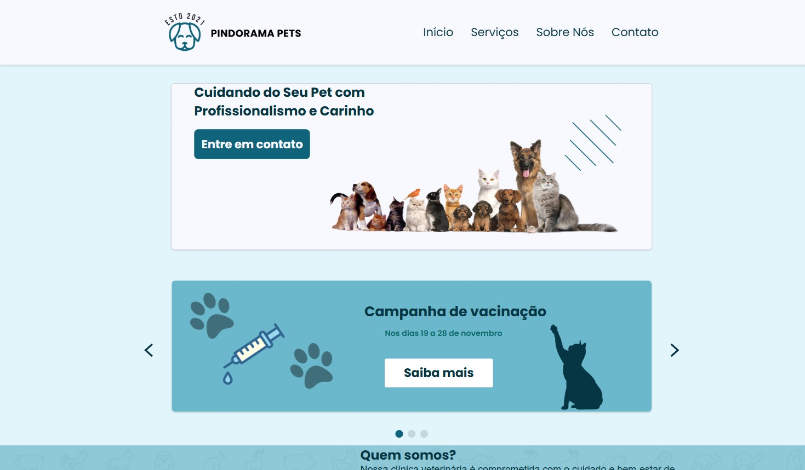
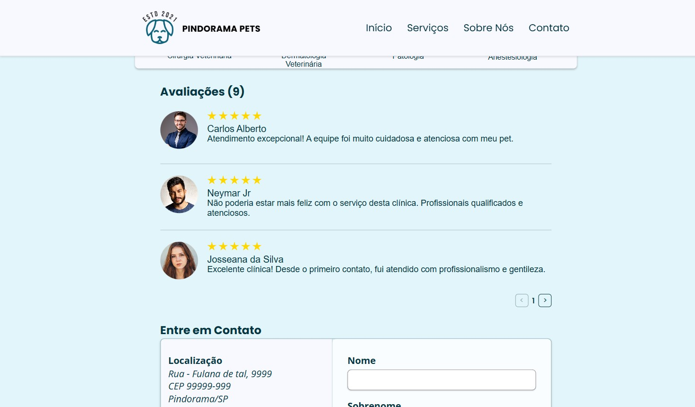
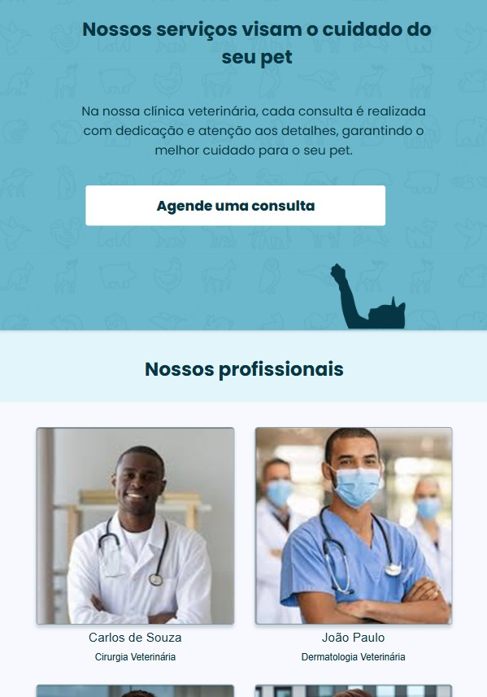

# 🐾 Pindorama Pets
O **Pindorama Pets** é um site institucional desenvolvido para uma clínica veterinária fictícia, com o objetivo de apresentar os serviços oferecidos, informações sobre a equipe e canais de contato com os clientes. O projeto foi desenvolvido como parte do **Processo Trainee da UNECT JR**.

## Prévia do Projeto

<section align="center">

    <h3>💻 Versão Desktop</h3>
    

        
        
    

    <h3>📱 Versão Mobile</h3>
    

        
        
    

</section>

## Visão Geral
A página foi construída com foco em **responsividade** e **experiência do usuário**, adaptando-se a diferentes dispositivos, desde **computadores (versão desktop)** até **smartphones (versão mobile)**.

## Stacks Utilizadas
- **HTML5** — estrutura semântica da página  
- **CSS3** — estilização, layout e responsividade  
- **JavaScript (Vanilla)** — interatividade e carrossel de imagens  
- **Design Responsivo** — adaptação para diferentes tamanhos de tela  
- **Miro** - kanban e organização
- **Telegram e Discord** - comunicação entre os desenvolvedores

# Links úteis
- [Protótipo](https://www.figma.com/design/mCZWN1CWKbOlrkhgx4alAw/Pindorama-Pets---Veterin%C3%A1ria?node-id=152-195&p=f)
- [Unect Jr. - Instagram](https://www.instagram.com/unectjr/)
- [Unect Jr. - Linkedin](https://www.linkedin.com/company/unectjr/posts/?feedView=all)

Feito com <3 por Matheus Madureira e Gabriel Cecílio